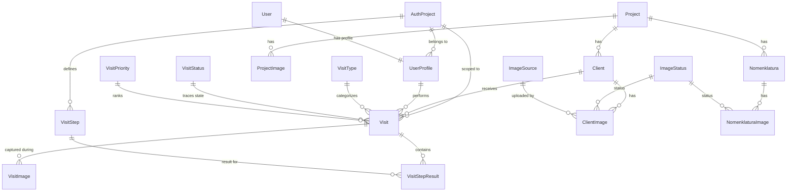
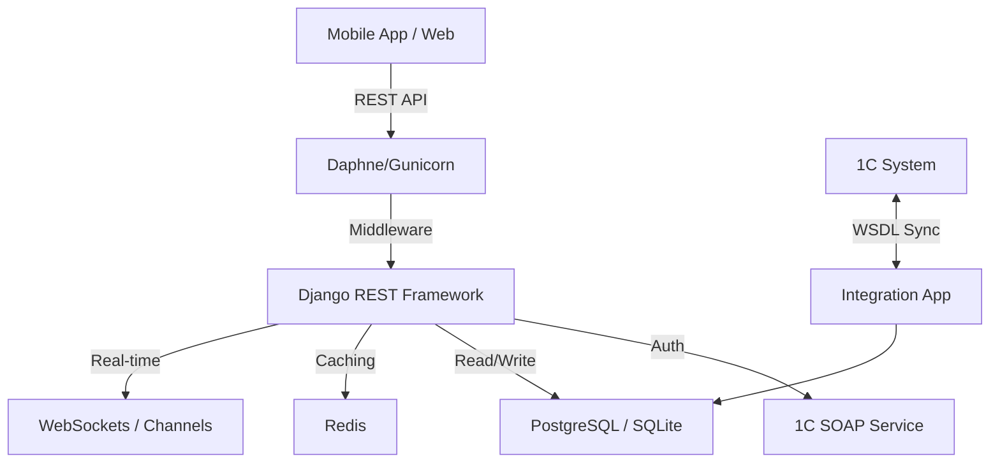

# E-Catalog Tizim Arxitekturasi (System Architecture)

Ushbu hujjat loyihaning umumiy texnik tuzilishi, modullari, ma'lumotlar bazasi sxemasi va integratsiya mantiqini birlashtirilgan holda tushuntiradi.

---

## 1. Texnik Umumiy Tavsif (Technical Overview)

### Texnologiyalar Steki (Technology Stack)
*   **Backend**: Django 5.2.7 (Python 3.14+)
*   **API Framework**: Django REST Framework (DRF)
*   **Database**: SQLite (Dev) / PostgreSQL (Prod)
*   **Caching**: Redis (django-redis)
*   **Real-time**: Django Channels (WebSockets)
*   **Frontend**: React (Vite)
*   **Dokumentatsiya**: drf-spectacular (OpenAPI/Redoc)
*   **Server**: Daphne/Gunicorn + Nginx

### Loyiha Tuzilishi (Directory Structure)
*   `api/`: Asosiy biznes mantiq, Loyihalar (Project), Rasmlar va Agent tracking.
*   `client/`: Mijozlar (Clients) va ularning rasmlari.
*   `nomenklatura/`: Mahsulotlar (Katalog), narxlar va qoldiqlar.
*   `users/`: Foydalanuvchilar, profillar va 1C auth mantiqi.
*   `visits/`: Agentlarning mijozlarga tashriflari (Visit), check-in/out va GPS.
*   `integration/`: 1C tizimi bilan SOAP/WSDL ulanishlari.
*   `references/`: Dinamik lug'atlar (Tashrif turlari, statuslar).
*   `utils/`: Mixinlar (isolation), pagination va yordamchi funksiyalar.

---

## 2. Ma'lumotlar Bazasi Arxitekturasi (Database Architecture)

### Umumiy Arxitektura Diagrammasi (ERD)

### Asosiy Modullar va Jadvallar
*   **AuthProject**: 1C bilan bog'lanish parametrlarini (WSDL, Failover URL) saqlaydi.
*   **UserProfile**: Agentning 1C kodi va loyihaga biriktirilishini boshqaradi.
*   **Client & Nomenklatura**: Asosiy kataloglar, `project` fieldi orqali loyihaga bog'langan bo'lishi mumkin (lekin hozirda global ko'rinishga ega).
*   **Visit**: Tashrif mantiqi, GPS koordinatalar va `VisitStepResult` (checklist) natijalarini saqlaydi.
*   **AgentLocation**: Agentlarning real-time harakat trayektoriyasi (breadcrumbs).

---

## 3. Asosiy Arxitektura Prinsiplari

### A. Multi-tenancy (Loyiha Izolyatsiyasi)
Tizim bir nechta mustaqil loyihalarni bitta bazada saqlaydi. `ProjectScopedMixin` orqali so'rovlar avtomatik ravishda foydalanuvchining loyihasiga ko'ra filtrlanadi.

### B. 1C Integratsiyasi va Failover
1C bilan bog'lanishda asosiy va zaxira (alternative) URL tizimi mavjud. Agar asosiy serverda uzilish bo'lsa, tizim avtomatik ravishda backup URL'ga o'tadi.

### C. Ma'lumotlar Oqimi (Data Flow)

---

## 4. Xavfsizlik va Optimizatsiya
*   **JWT Auth**: Xavfsiz token-almashtirish tizimi.
*   **Mandatory Pagination**: Katta hajmdagi ma'lumotlar (masalan, 70k+ klientlar) bilan ishlashda tizim barqarorligini ta'minlash uchun majburiy pagination.
*   **N+1 Optimization**: `prefetch_related` va `select_related` orqali bazaga so'rovlar sonini kamaytirish.
*   **Soft Delete**: Ma'lumotlarni tasodifiy o'chib ketishidan himoya qilish.
